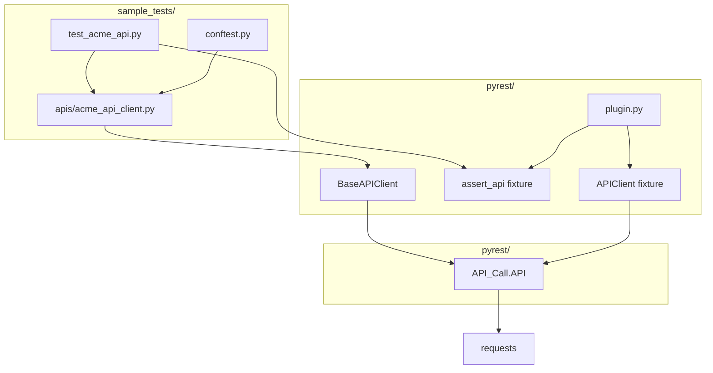

# Adding a New API

This guide explains how APIs are managed in **pytest-pyrest** and walks through adding a new API set step by step. The Petstore integration in `code/sample_tests/` is the reference implementation.

## How APIs Are Managed

The framework uses three layers:

```
Tests (test_*.py)
    ↓ fixtures: api_client, assert_api, or domain-specific client
Client layer (optional domain client, or built-in APIClient)
    ↓ wraps
Base HTTP layer (pyrest.API_Call.API)
    ↓ uses
requests library
```

| Layer | Location | Role |
|-------|----------|------|
| Base HTTP | `code/pyrest/API_Call.py` | Low-level `API` class. Every call returns an `API` object with `status`, `content`, `json`, etc. |
| Plugin | `code/pyrest/plugin.py` | Pytest plugin: loads env vars, provides `api_client` and `assert_api` fixtures |
| Shared base | `code/pyrest/base_client.py` | `BaseAPIClient` with URL, header, auth, and SSL wiring for domain clients |
| Domain client | `code/sample_tests/apis/` | Optional typed client with one method per endpoint (e.g. `petstore_api_client.py`) |
| Tests | `code/sample_tests/test_*.py` | Pytest tests that use fixtures and assertion helpers |
| Config | `code/sample_tests/env/*.csv` | Environment variables loaded at test collection time |

### Two Ways to Call an API

**Option A — Generic client (quick start)**

Use the built-in `api_client` fixture for ad-hoc endpoint strings. No new files required.

```python
@pytest.mark.api
def test_list_items(api_client, assert_api):
    response = api_client.get("api/v1/items")
    assert_api.status_code(response, 200)
```

**Option B — Domain client (recommended for a full API surface)**

Create a dedicated client class with typed methods, fixtures, and tests grouped by resource. This is how Petstore is implemented and is the pattern to follow when adding a substantial API.

The rest of this guide covers **Option B**.

---

## Step-by-Step: Add a New API

The examples below use a fictional **Acme API** (`https://api.acme.example/v1`). Replace names, endpoints, and auth details with your own.

### Step 1: Plan Your API Surface

Before writing code, decide:

1. **Base URL** — Will you reuse `envURL` or add a dedicated variable (e.g. `ACME_API_URL`)?
2. **Authentication** — Basic auth, bearer token, API key header, or none?
3. **Endpoints** — List the resources and HTTP methods you need to test.
4. **Public vs authenticated** — Which operations require credentials?

Example plan:

| Method | Endpoint | Auth required |
|--------|----------|---------------|
| GET | `/v1/items` | No |
| GET | `/v1/items/{id}` | No |
| POST | `/v1/items` | Yes (API key) |
| DELETE | `/v1/items/{id}` | Yes (API key) |

---

### Step 2: Add Environment Variables

Add credentials and URLs to your environment CSV file.

**File:** `code/sample_tests/env/test-environment.csv`

Format is two columns per row, no header:

```csv
envURL,https://petstore.swagger.io/v2
ACME_API_URL,https://api.acme.example
ACME_API_KEY,your_api_key_here
```

The plugin loads this file during test collection (`pytest_collection_modifyitems` in `plugin.py`). Values are written to `os.environ` and read by your client fixtures.

You can also pass a different file at runtime:

```bash
uv run pytest --env-file=path/to/my-environment.csv
```

---

### Step 3: Create the Domain Client

Create a new file under `code/sample_tests/apis/`.

**File:** `code/sample_tests/apis/acme_api_client.py`

Follow the Petstore client structure:

1. Subclass `BaseAPIClient` from `pyrest`
2. Override `_auth_headers()` if you need header-based auth (API keys, bearer tokens)
3. Add one public method per endpoint
4. Define pytest fixtures at the bottom of the same file

#### 3a. Client class

```python
import os
from typing import Any, Optional

import pytest
from pyrest import BaseAPIClient
from pyrest.API_Call import API


class AcmeAPIClient(BaseAPIClient):
    """Client for the Acme REST API."""

    def __init__(
        self,
        base_url: str,
        api_key: str = "",
        verify_ssl: bool = True,
        cert_path: Optional[str] = None,
    ):
        super().__init__(
            base_url,
            verify_ssl=verify_ssl,
            cert_path=cert_path,
        )
        self.api_key = api_key

    def _auth_headers(self) -> dict[str, str]:
        if self.api_key:
            return {"Authorization": f"Bearer {self.api_key}"}
        return {}
```

**Key pattern:** Subclass `BaseAPIClient` so URL, headers, basic auth, and SSL wiring live in one place. Override `_auth_headers()` for header-based auth. See `PetstoreAPIClient` in `petstore_api_client.py` for the canonical example.

#### 3b. Endpoint methods

Each method follows the same three steps: create instance → call API → return response.

```python
    def get_items(self, params: Optional[dict[str, Any]] = None) -> API:
        api = self._create_api_instance(
            endpoint="/v1/items",
            method="GET",
            params=params,
        )
        api.CallAPI()
        return api

    def get_item(self, item_id: int) -> API:
        api = self._create_api_instance(
            endpoint=f"/v1/items/{item_id}",
            method="GET",
        )
        api.CallAPI()
        return api

    def create_item(self, name: str, description: str = "") -> API:
        if not self.api_key:
            raise ValueError("API key required for creating items")

        api = self._create_api_instance(
            endpoint="/v1/items",
            method="POST",
            data={"name": name, "description": description},
        )
        api.CallAPI()
        return api

    def delete_item(self, item_id: int) -> API:
        if not self.api_key:
            raise ValueError("API key required for deleting items")

        api = self._create_api_instance(
            endpoint=f"/v1/items/{item_id}",
            method="DELETE",
        )
        api.CallAPI()
        return api
```

For **basic auth** instead of a bearer token, pass `username=` and `password=` to `BaseAPIClient.__init__` (or use `get_auth()` from `pyrest.plugin`) rather than an `Authorization` header.

#### 3c. Pytest fixtures

Define fixtures in the same file, reading from environment variables:

```python
@pytest.fixture
def acme_client():
    """Unauthenticated or read-only Acme API client."""
    base_url = os.getenv("ACME_API_URL", os.getenv("envURL", "https://api.acme.example"))
    return AcmeAPIClient(base_url=base_url, verify_ssl=True)


@pytest.fixture
def authenticated_acme_client():
    """Acme API client with credentials. Skips test if key is missing."""
    base_url = os.getenv("ACME_API_URL", os.getenv("envURL", "https://api.acme.example"))
    api_key = os.getenv("ACME_API_KEY")

    if not api_key:
        pytest.skip("ACME_API_KEY environment variable required")

    return AcmeAPIClient(base_url=base_url, api_key=api_key, verify_ssl=True)
```

This mirrors the `petstore_client` / `authenticated_petstore_client` pattern in `petstore_api_client.py`.

---

### Step 4: Register Fixtures in conftest.py

Export your new fixtures so pytest discovers them project-wide.

**File:** `code/sample_tests/conftest.py`

```python
"""PyTest configuration for sample tests."""

from apis.acme_api_client import acme_client, authenticated_acme_client
from apis.petstore_api_client import (
    authenticated_petstore_client,
    petstore_client,
)

__all__ = [
    "acme_client",
    "authenticated_acme_client",
    "authenticated_petstore_client",
    "petstore_client",
]
```

Without this import, fixtures defined in `apis/` are not automatically available to test files unless those files import them directly.

---

### Step 5: Write Tests

Create a test file alongside the existing examples.

**File:** `code/sample_tests/test_acme_api.py`

```python
"""Tests for the Acme REST API."""

import pytest

pytestmark = pytest.mark.api


class TestAcmeItems:
    """Read-only item tests."""

    def test_get_items(self, acme_client, assert_api):
        response = acme_client.get_items()

        assert_api.status_code(response, 200)
        assert_api.has_content(response)
        assert isinstance(response.json, list)

    def test_get_item_by_id(self, acme_client, assert_api):
        items_response = acme_client.get_items()
        assert_api.status_code(items_response, 200)

        if items_response.json:
            item_id = items_response.json[0]["id"]
            response = acme_client.get_item(item_id)

            assert_api.status_code(response, 200)
            assert response.json["id"] == item_id


class TestAcmeAuthenticatedOperations:
    """Tests that require an API key."""

    def test_create_item(self, authenticated_acme_client, assert_api):
        response = authenticated_acme_client.create_item(
            name="Test Item",
            description="Created by pytest",
        )

        assert_api.status_code(response, 201)
        assert_api.json_contains(response, "id")
        assert_api.json_contains(response, "name", "Test Item")
```

**Testing conventions used in this project:**

- Mark tests with `@pytest.mark.api` or set `pytestmark = pytest.mark.api` at module level
- Use `assert_api` helpers: `status_code`, `has_content`, `json_contains`, `success`, `failure`
- Group related tests into classes (`TestAcmeItems`, `TestAcmeAuthenticatedOperations`)
- Use `authenticated_*` fixtures for write operations; they auto-skip when credentials are missing
- Validate auth requirements in client methods with `raise ValueError(...)` for immediate feedback in unit-style usage

---

### Step 6: Run Your Tests

```bash
# Run all API-marked tests
uv run pytest -m api

# Run only your new test file
uv run pytest code/sample_tests/test_acme_api.py

# Run with a custom environment file
uv run pytest --env-file=code/sample_tests/env/test-environment.csv code/sample_tests/test_acme_api.py

# Verbose API logging
uv run pytest --api-log-level=DEBUG code/sample_tests/test_acme_api.py -v
```

---

## Quick Reference Checklist

Use this when adding any new API:

- [ ] **Env vars** added to `code/sample_tests/env/test-environment.csv` (or a custom CSV)
- [ ] **Client file** created at `code/sample_tests/apis/<name>_api_client.py`
  - [ ] Subclasses `BaseAPIClient`
  - [ ] Overrides `_auth_headers()` when using header-based auth
  - [ ] One public method per endpoint; each calls `api.CallAPI()` and returns `api`
  - [ ] Auth-guarded methods raise `ValueError` or fixtures use `pytest.skip`
  - [ ] `@pytest.fixture` definitions for unauthenticated and authenticated clients
- [ ] **conftest.py** updated to import and export new fixtures
- [ ] **Test file** created at `code/sample_tests/test_<name>_api.py`
  - [ ] Tests marked with `@pytest.mark.api`
  - [ ] Uses `assert_api` for assertions
  - [ ] Test classes grouped by resource or concern
- [ ] **Tests pass** against a reachable API instance

---

## Architecture Reference



---

## Existing Examples

| File | What it demonstrates |
|------|---------------------|
| `code/sample_tests/apis/petstore_api_client.py` | Full domain client with fixtures (`BaseAPIClient` subclass) |
| `code/sample_tests/test_petstore_api.py` | Test organization by resource, auth vs public, workflows |
| `code/sample_tests/util_petstore.py` | Shared models, payloads, and assertion helpers |
| `code/pyrest/plugin.py` | Plugin fixtures, env loading, `get_auth`, assertion helpers |
| `code/pyrest/base_client.py` | Shared base for domain clients |
| `code/pyrest/API_Call.py` | Base `API` class all clients delegate to |

---

## Auth Patterns

Different APIs use different auth. Here is how to handle common cases:

| Auth type | How to configure |
|-----------|------------------|
| None | Leave username/password empty; do not override `_auth_headers` |
| Basic auth | Pass `username=` / `password=` to `BaseAPIClient`, or use `get_auth()` for the generic `api_client` |
| Bearer token | Override `_auth_headers` to return `Authorization: Bearer <token>` |
| API key header | Override `_auth_headers` to return e.g. `api_key: <key>` (Petstore pattern) |
| Per-request override | Accept optional `headers=` in public methods and pass them to `_create_api_instance` |

The generic `api_client` fixture reads basic auth from `API_USERNAME` / `API_PASSWORD` via `get_auth()`, and supports per-request auth via `auth=(username, password)` and custom headers via the `headers=` kwarg.

---

## When to Use Which Approach

| Scenario | Approach |
|----------|----------|
| One or two smoke tests against an existing API | Generic `api_client` (Option A) |
| Many endpoints, reusable across test files | Domain client (Option B) |
| Shared auth logic and default headers | Domain client |
| CRUD workflows and resource-specific helpers | Domain client |
| Prototyping before committing to a client API | Start with `api_client`, refactor to domain client later |
